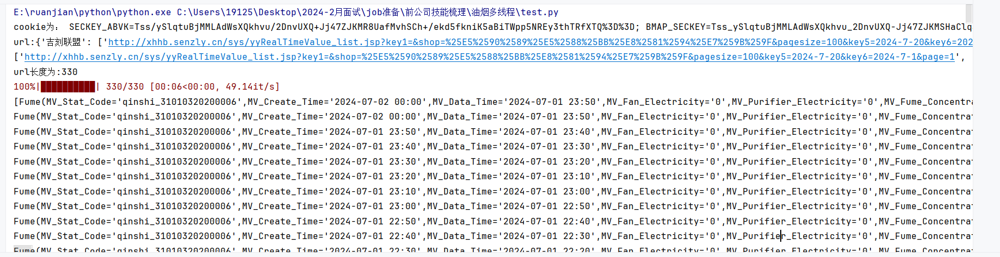
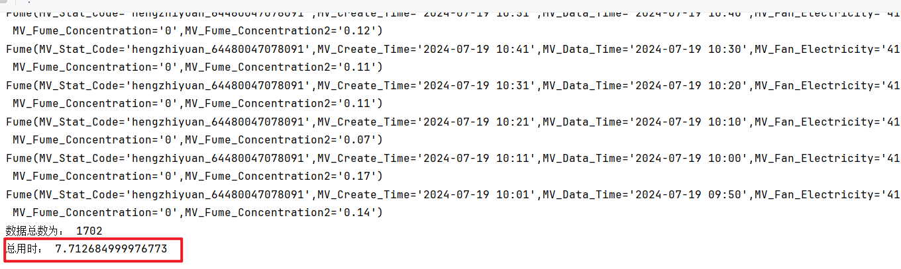
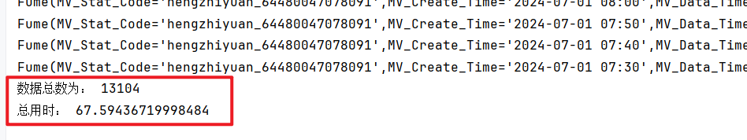

多线程：7.8s  1702条数据

顺序执行： 67.6s  13104条数据

异步并发最终的数据数量少于预期值：
猜测：Python的列表非线程安全。并发会导致数据增加失败

`异步爬虫总是前三个请求 的数据为0`

这个问题的`根因是`：
1.未限制并发量
        使用信号量semaphore机制，限制并发请求为3。
~~~
    con_req = 3
    sem = asyncio.Semaphore(con_req)
    async with semaphore:
    html = await get_fume(client, cc)
~~~

2.未携带请求头的User-Agent到htppx库
~~~
    async with AsyncClient() as client:
        headers = { "User-Agent": "Mozilla/5.0 (Windows NT 10.0; Win64; x64) AppleWebKit/537.36 (KHTML, like Gecko) Chrome/114.0.0.0 Safari/537.36",}
        client.headers.update(headers)
        
~~~

怎么发现是并发量的问题？
讲每次请求的数据记录在日志文件中，发现前三次的请求必为空。而顺序请求都能在正常获得数据。
我推断除服务器那边是正常的收发数据，问题应该是代码写的不对
对比顺序请求，发现未加请求头。加了请求头后，还是少数据。
今天刚好看到书中利用信号量在限制并发量，我就往限制并发量方向考虑，结果这就是根因。
